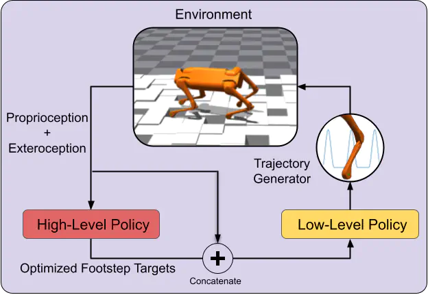

# Hierarchical Reinforcement Learning and Value Optimization for Challenging Quadruped Locomotion


# Isaacgym

Modified by Jeremiah Coholich for use in training on the [Unitree Aliengo](https://www.unitree.com/products/aliengo/) robot for the project [Hierarchical Reinforcement Learning and Value Optimization for Challenging Quadruped Locomotion](https://www.jeremiahcoholich.com/publication/hrl_optim/).
Original code from NVIDIA:
https://developer.nvidia.com/isaac-gym (Preview Release 2)

Models are trained with my fork of the rl_games repo, which includes support for logging with [Weights and Biases](https://wandb.ai/site), among other things.

rl_games fork: https://github.com/jmcoholich/rl_games

This README contains instructions for installing both my modified versions of
isaacgym and the rl_games library.

The full documentation for IsaacGym can be found in `~/isaacgym/docs/`


## Features
Here is list of features I have added:
- fast vectorized analytical inverse kinematics for the Aliengo quadruped
- multi-GPU policy evaluation and data gathering pipeline
- procedural terrain generation
- logging with [Weights and Biases](https://wandb.ai/site)
- my [value-function footstep optimization method](https://www.jeremiahcoholich.com/publication/quadruped_footsteps/)
- scripts for generating videos from simulation cameras (vs screencap)
- [Augumented Random Search](https://arxiv.org/abs/1803.07055) as an alternative to [PPO](https://arxiv.org/abs/1707.06347)

## Prereqs
- Ubuntu 18.04 or 20.04.
- Python 3.6, 3.7 or 3.8.
- Minimum NVIDIA driver version: 460.32
    - Note: Even if you have no NVIDIA gpu, you will need to install an NVIDIA
    driver in order to run Isaacgym (I haven't found a better workaround).


To install an NVIDIA driver

    sudo apt update
    sudo apt install nvidia-driver-470

## To install IsaacGym + RL_Games locally

    cd ~
    git clone git@github.com:jmcoholich/isaacgym.git
    cd isaacgym
    conda env create -f python/rlgpu_conda_env.yml
    conda activate rlgpu
    cd python
    pip install -e .
    cd ~
    git clone git@github.com:jmcoholich/rl_games.git
    cd rl_games
    pip install -e .

## To test installation

    cd ~/isaacgym/python/examples
    python joint_monkey.py

### Known Issues

`ImportError: libpython3.7m.so.1.0: cannot open shared object file: No such file or directory` can be solved by adding the following to your `~/.bashrc` file:

```export LD_LIBRARY_PATH=/home/username/miniforge3/envs/rlgpu/lib```

miniforge3 is used because I am using mamba instead of conda (highly recommended).

Utilities like `nano` or `watch` result in segmentation fault.

```
cd /home/username/miniforge3/envs/rlgpu/lib
rm libtinfo*
rm libncursesw*
```

## To run training
### Baseline end-to-end RL policy
```python rlg_train.py --cfg_env 12_F --seed 0 --device 0 --headless --cfg_train 12```

To playback trained end-to-end policy

```python rlg_train.py --play --checkpoint <run ID>```

### Proposed method
```python rlg_train.py --cfg_env 12_H_new_sota --seed 0 --device 1 --cfg_train 12 --headless```

Playback trained policy

```python rlg_train.py --play --checkpoint <run ID>```

<!-- ### New Stuff
```rlg_train.py --cfg_env 12_H_new_experiment --seed 1 --device 1 --cfg_train 12 --task AliengoRandom --headless```

Playback trained policy

```python rlg_train.py --play --checkpoint <run ID> --task AliengoRandom```

To plot footstep targets add the flag `-asdf`

To debug device-side asserts, switch to CPU pipeline with the flag `--pipline cpu`. This results in an actual stack trace. -->

## Generalization/ High-level evaluation


To evaluate the flat and hierarchical policy and generate all figures, run:

```bash generate_results.bash <hierarchical policy id>  <flat policy id> <name of plots folder>```

To generate paper results from the saved checkpoints, run

```bash generate_results.bash 123750 1234750 <name of plots folder> 1 50```

To just generate the plots from saved checkpoint evaluations, run

```python generate_all_plots.py --h_id 123750 --f_id 1234750 --save_dir plots/post_acc --no_regen```

#### All Evaluation
To evaluate a flat RL policy run


`python evaluate_policy.py --id <run_id> --flat_policy True`

To evaluate the propose hierarchical method run

`python evaluate_policy.py --id <run_id> --flat_policy False`


The `evaluate_policy.py` script is parallelized across gpus and will automatically scale to use all available gpus.

#### Commands breakdown

As mentioned in the [paper](https://www.jeremiahcoholich.com/publication/quadruped_footsteps/quadruped_footsteps.pdf), the high level does not require training.

The high level policy takes three hyperparameters:
- The desired direction of travel. This number is given as a multiple of pi, so `--des_dir 0.0` corresponds to forward while `--des_dir 1.0` is backwards.
- The coeffient for the desired direction term of the optimization. This balances the directional term of the cost function with the value function for footsteps. `--des_dir_coef 1.0` corresponds to a coeffient of 1. `--des_dir_coef 0.0` means the agent will just pick the highest value footstep targets (which are basically in-place)
- `--box_len` is the size of the box around the current footsteps that the high level policy will search in

By default, the stepping stones (ss) in the training environment are a sort of curriculum that becomes more challenging as the robot progresses in the x-direction and in the plus or minus y-direction. However, during evaluation we would like to test on terrain of uniform difficulty, so we use the following arguments.
Terrain parameters and arguments:
`--add_ss` needed to pass custom stepping stone terrain parameters
`--ss_infill` value in (0.0, 1.0] which represents the fraction of infill. Lower is harder
`--ss_height_var` This is a positive float representing range of variation of stepping stone heights. Higher is harder.
`--no_ss` removes stepping stones from the environment

Other parameters: \
`--footstep_targets_in_place` stops the footstep target generation from occuring that the low-level policy is trained on. \
`--two_ahead_opt` means the high-level jointly optimizes over the next footstep targets and the pair of targets after that. It has better performance and should be on by default, BUT ONLY WHEN `--des_dir 0.0` TODO change this\
`--plot_values` The locations where the feet make contact with the ground are plotted with dots. Each leg has its own color. The next footstep targets are marked with red columns.


To walk forward on flat ground:

```python rlg_train.py --play --checkpoint <run ID> --num_envs 1 --no_ss --plot_values --des_dir_coef 1.0 --des_dir 0.0 --footstep_targets_in_place --two_ahead_opt```


To walk forward on stepping stones:
```python rlg_train.py --play --checkpoint <run ID> --num_envs 1 --add_ss --ss_infill 0.75 --ss_height_var 0.1 --plot_values --des_dir_coef 1.0 --des_dir 0.0 --footstep_targets_in_place --two_ahead_opt```


<!-- ### New Evaluation

TODO -->


<!-- ## Running on Skynet (Docker required due to Skynet using Ubuntu 16.04)

In a screens or tmux session, check out a node with:

    srun <args> --pty bash
    cd isaacgym
    bash docker/build.sh
    bash docker/run_sn.sh

This will start a Docker container where you can start training runs.

To train PMTG for trotting:

    python rlg_train.py --cfg_env pmtg_trot --seed 0 --device 0 --headless

To copy model files from docker container to SkyNet, ssh into the node you are
using, then within `isaacgym/docker/`, run

    bash copy_nn.sh

To visualize trained models from skynet:

    python rlg_train.py --play --checkpoint <run_id> --ws 7 --username jcoholich3

Replace jcoholich3 with your SkyNet username.

There is no need to copy the model from skynet to your local machine. Assuming
you have ssh set up, the program will remote into skynet and load the trained
model.

## Running on Skynet with sbatch
On the head node run:

    sbatch --gres gpu:4 submit.sh

replacing 4 with desired number of runs, up to 8 (one run per GPU).

If there is a desired node (perhaps with the docker image already built),
add the -w option.

    sbatch --gres gpu:4 -w clank submit.sh

submit.sh already has the other sbatch options, and it builds the docker image

submit.sh calls docker/sbatch_run.sh. This script starts the docker container
and runs docker/sbatch_docker_run.sh in it then cleans everything
up after sbatch_docker_run.sh finishes.

sbatch_docker_run.sh has the actual python command to start the training run.
Edit this script to change the python command. -->